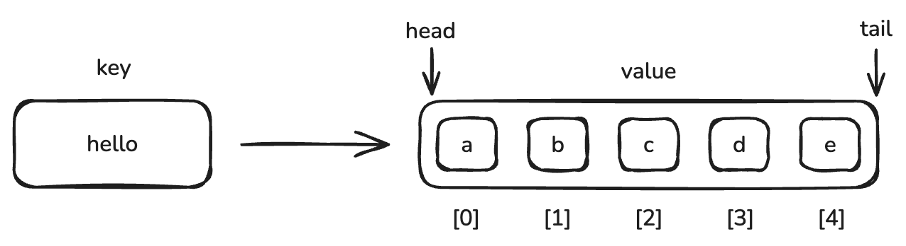
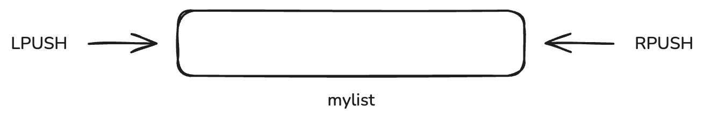
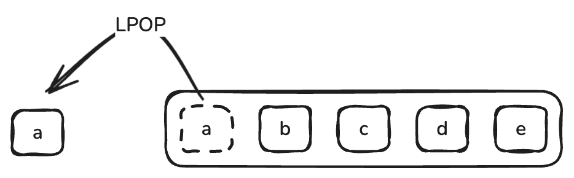

# Redis list

## 1 list 기본 개념



Redis 에서 `list` 는 **순서를 가지는 문자열 목록** 입니다. 하나의 list 에는 최대 42억여 개의 값을 저장할 수 있습니다. 일반적인 배열처럼 index 를 통해 값에 접근할 수 있으며 서비스에서 stack 또는 queue 로 활용됩니다.

## 2 값 저장 및 조회



LPUSH 명령은 list 의 왼쪽에 값을 넣고 RPUSH 명령은 list 의 오른쪽에 값을 넣습니다.  

**LPUSH**
```bash
lpush mylist a
```


**RPUSH**
```bash
rpush mylist b
```

그리고  `LRANGE`  명령으로 리스트의 데이터를 조회할 수 있습니다.

**LRANGE**
```bash
lrange mylist 0 -1
```

**결과**
```text
1) "a"
2) "b"
```

`LPUSH` 와 `RPUSH` 연산은 한번에 여러 값을 넣는 것을 지원합니다.

```bash
rpush mylist c d e f
lrange mylist 0 -1
```

**결과**
```text
1) "a"
2) "b"
3) "c"
4) "d"
5) "e"
6) "f"
```

`LRANGE` 는 시작과 끝 값의 index 를 각각 인수로 받아 출력합니다. 이때 index 는 음수가 될 수 있으며 가장 오른쪽 값의 index 는 `-1` 입니다. 그 앞의 Index 는 -2 입니다.

예제에서 나온 `lrange mylist 0 -1` 은 list 전체를 출력하라는 의미 입니다. 만약 처음 부터 index 3 까지의 (4개) 값만 출력하고 싶을 경우 다음과 같이 명령을 할 수 있습니다.

```bash
lrange mylist 0 3
```

**결과**
```text
1) "a"
2) "b"
3) "c"
4) "d"
```

## 3 값 반환




`LPOP` 명령은 `list` 에 저장된 가장 첫번째 값을 반환함과 동시에 `list` 에서 해당 값을 제거합니다. 숫자와 함께 사용할 경우 지정한 수만큼 아이템을 반복해서 반환합니다.

`LPOP`
```bash
lpop mylist
"a"
lrange mylist 0 -1
```

**결과**
```text
1) "b"
2) "c"
3) "d"
4) "e"
5) "f"
```

`a` 가 사라진 것을 확인할 수 있습니다. 

**LPOP - 한번에 여러개**
```bash
lpop mylist 4
```

**결과**
```text
1) "f"
```

만약 남아있는 값의 수보다 많이 pop 하게 될 경우 값이 하나라도 꺼내지면 해당 값들만 반환하고 반환할 값이 없다면 `nil` 값이 반환됩니다.

**LPOP - 남은 원소보다 더 많이**
```bash
lpop mylist 3
1) "f"
```

**빈상태에서 LPOP**
```bash
lpop mylist
(nil)
```

## 4 값 삭제

`LTRIM` 명령은 시작과 끝 값의 index 를 인자로 전달 받아 지정한 범위에 속하지 않은 값을 모두 삭제합니다. `LPOP` 과는 다르게 값을 반환하지 않습니다. 

```bash
rpush mylist a b c d e f ## mylist 초기화
(integer) 6

ltrim mylist 0 3         ## mylist 에서 0 - 3 인덱스 제외 모두 삭제
OK

lrange mylist 0 -1
1) "a"
2) "b"
3) "c"
4) "d"
```

0 부터 3번째 index 에 포함되는 a, b, c, d 를 제외한 e, f 가 삭제된 것을 확인할 수 있습니다.

## 5 고정된 길이의 Queue 유지하기

`LPUSH` 명령과 `LTRIM` 명령을 조합하면 고정된 길이의 Queue 를 유지할 수 있습니다. `list` 에 로그를 저장하는 상황에 대해 생각해 보겠습니다.

로그는 계속 쌓이는 데이터이기 때문에 주기적으로 로그 데이터를 삭제해 저장공간을 확보하는 것이 일반적입니다. redis list 에 최대 1,000 개의 데이터를 보관하고 싶을 경우 다음과 같이 명령어들을 조합할 수 있습니다.

```bash
lpush logdata <data>
ltrim logdata 0 999
```

위 명령어는 log data 가 1,001 개가 되기 전 까지 1000 번 index 가 없으므로 아무런 동작이 일어나지 않습니다. 하지만 데이터가 1,001 개가 되는 순간 1,000 번째 index 데이터가 삭제됩니다.

## 6 원하는 위치에 데이터 삽입하기 

`LINSERT` 명령은 원하는 데이터 앞이나 뒤에 데이터를 추가할 수 있습니다. 

```bash
del mylist ## list 초기화
(integer) 1

rpush mylist a b c d 
(integer) 4

linsert mylist before b 1 ## b 앞에 1 삽입
(integer) 5

linsert mylist after b 2 ## b 뒤에 2 삽입
(integer) 6

lrange mylist 0 -1
1) "a"
2) "1"
3) "b"
4) "2"
5) "c"
6) "d"
```

b 의 앞 뒤에 1과 2가 잘 삽입된 것을 확인할 수 있습니다.

```bash
linsert mylist before k 10
(integer) -1
```

만약 존재하지 않는  옆에 데이터를 삽입하려고 하면 오류를 반환합니다.

```bash
del mylist # list 초기화
(integer) 1 

rpush mylist a b c b e
(integer) 5

lrange mylist 0 -1
1) "a"
2) "b"
3) "c"
4) "b"
5) "e"

linsert mylist before b 1
(integer) 6

lrange mylist 0 -1
1) "a"
2) "1"
3) "b"
4) "c"
5) "b"
6) "e"
   
linsert mylist before b 1
(integer) 7

lrange mylist 0 -1
1) "a"
2) "1"
3) "1"
4) "b"
5) "c"
6) "b"
7) "e"
```

만약 값이 중복되는 원소들이 있을 경우 맨 왼쪽에 있는 값을 기준으로 `LINSERT` 연산이 수행됩니다. 

## 7 특정 index 값 바꾸기 

`LSET` 명령을 통해서 특정 index 의 값을 변경할 수 있습니다.

```bash
del mylist
(integer) 1

rpush mylist 1 2 3 4
(integer) 4

lrange mylist 0 -1
1) "1"
2) "2"
3) "3"
4) "4"

lset mylist 2 5
OK

lrange mylist 0 -1
1) "1"
2) "2"
3) "5"
4) "4"
```

2 번 index 에 위치한 3 이 5로 변경된 것을 확인할 수 있습니다. 

```bash
lset mylist 10 5
(error) ERR index out of range
```

만약 index 범위를 벗어나게 된다면 error 가 발생하게 됩니다.

## 8 index 기반 데이터 조회하기

```bash
lindex mylist 2
"5"
```

`LINDEX` 명령을 통해 리스트의 특정 index 에 위치한 값을 조회할 수 있습니다.

## 9 시간 복잡도

list 에서 값을 넣고 빼는 `LPUSH` `LPOP` `RPUSH` `RPOP` 명령은 모두 시간복잡도가 $O(1)$ 입니다. 아지만 index 나 데이터를 이용해서 list 중간 데이터에 접근할 때에는 $O(n)$ 으로 처리되며 list 에 데이터가 많을 수록 성능이 저하됩니다.
