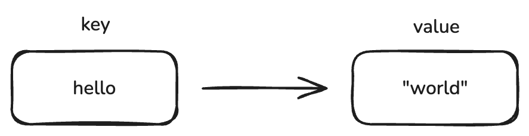

# Redis string

## 1 string 기본 개념



`string` 은 Redis 에서 데이터를 저장할 수 있는 가장 간단한 자료구조 입니다. 다음과 같은 특징이 있습니다.

- 최대 512MB의 문자열 데이터를 저장 가능
- 이진데이터를 포함한 모든 종류의 문자열이 binary safe 하게 처리되어 JPEG 이미지와 같은 바이트 값, Http 응답 밧등의 다양한 데이터를 저장 가능

`string` 은 key 와 실제 저장 되는 value 가  1 : 1 로 매칭되는 유일한 자료구조입니다. `string` 을 제외한 다른 자료구조에서는 하나의 key 에 여러 value 가 연결될 수 있습니다.

## 2 string 사용해보기

### 값 저장 및 조회

`set` 과 `get` command 를 이용해서 string 자료구조에 값을 저장 및 조회할 수 있습니다.

```bash
set hello world
get hello
```

**결과**
```text
"world"
```

만약 `set` 과 함께 `nx` 옵션을 사용할 경우 **지정한 키가 없을 경우에만 새로운 키를 저장**합니다.

```bash
set hello tick nx
get hello
```

**결과**
```text
"world"
```

데이터가 없을 경우에는 어떨까요 ?

**hello 삭제 후 nx 삽입** 
```bash
del hello
set hello world nx
get hello 
```

**결과**
```text
"world"
```


반대로 `xx` 옵션을 사용할 경우 키가 있을 경우에만 새로운 값으로 덮어 쓰며 새로운 키를 생성하진 않도록 동작합니다.

**xx option - 기존 key 가 없는 경우** 
```bash
set test test! xx
get test
```

**결과**
```
(nil)
```

**xx option - 기존 key 가 있는 경우** 
```bash
set hello test! xx
get hello
```

**결과**
```
"test!"
```

### 숫자 다루기

`string` 자료구조에 숫자 형태의 데이터 또한 저장할 수 있습니다. `INCR` 과 `INCRBY` 같은 커맨드를 사용하면 `string` 자료구조에 저장된 숫자를 원자적으로 조작할 수 있습니다.

먼저 기본값을 세팅하겠습니다.

**숫자 세팅**
```bash
set counter 100
```

**값 1 증가**
```bash
incr counter
```

**결과**
```text
(integer) 101
```

값이 1 증가한 것을 확인할 수 있습니다. 만약에 한번에 많은 값을 더하고 싶을 경우 `incrby` command 를 사용할 수 있습니다.

**원상 복귀**
```bash
set counter 100
```

**값 100 증가**
```bash
incrby counter 100
```

**결과**
```bash
(integer) 200
```


`incr` 과 `incrby` 명령어로 값을 증가시킨 것 과 반대로 `decr` `decrby` 명령어를 통해 값을 감소시킬 수 있습니다.

**원상 복귀**

**숫자 세팅**
```bash
set counter 100
```

**값 1 감소**
```bash
decr counter
```

**결과**
```text
(integer) 99
```

**값 9 감소**
```bash
decrby counter 9
```

**결과**
```text
(integer) 90
```

> [!TIP]
> string 자료구조에 저장할 수 있는 정수 최대값은 9223372036854775807 (약 922 경) 입니다. 이 상태에서 incr 명령을 할 경우  `(error) ERR increment or decrement would overflow` error 가 발생합니다. 
> 최소값도 마찬가지로 -9223372036854775808 (약 -922 경) `decr` 명령을 할 경우 `(error) ERR increment or decrement would overflow` 에러가 발생합니다.
 

## 3 MSET, MGET - 여러 키 한번에 조작하기

`MSET`, `MGET` command 를 사용하면 여러 키를 한번에 조작할 수 있습니다.

**MSET**
```bash
mset a 10 b 20 c 30
```

**MGET**
```bash
mget a b c
```

**결과**
```text
1) "10"
2) "20"
3) "30"
```
