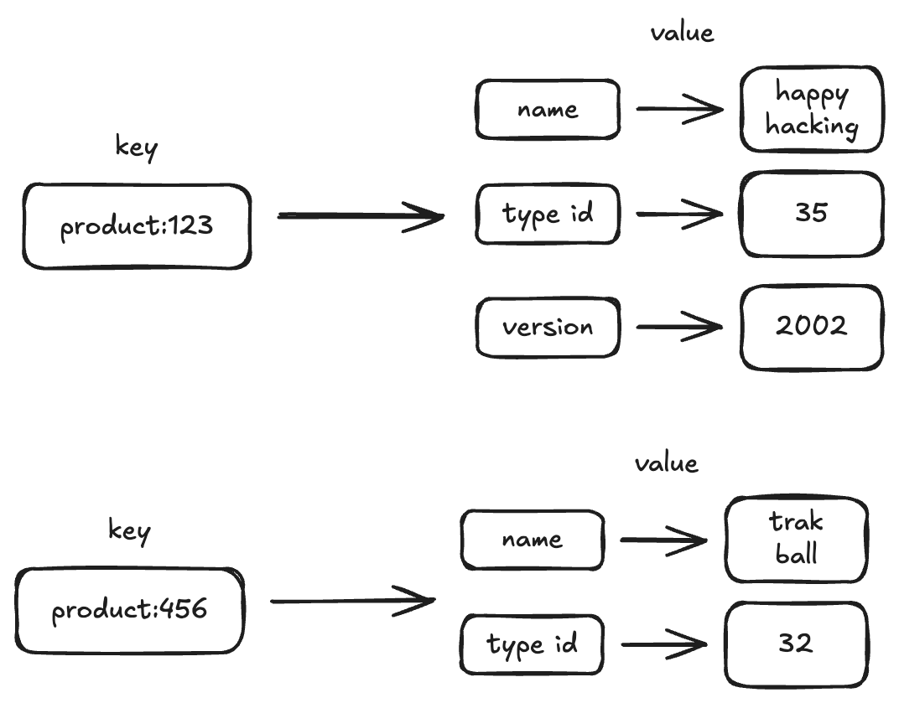

# Redis hash



## 1. hash 기본 개념

레디스에서 hash 는 필드 - 값의 쌍을 가진 아이템의 집합입니다. 레디스에서 데이터가 key - value 쌍으로 저장되는 것 처럼 하나의 hash 자료구조 내에서 아이템은 필드 값 쌍으로 저장됩니다.

필드는 하나의 hash 자료 구조 내에서 유일하며, 필드와 값 모두 문자열 데이터로 저장됩니다.
hash 는 객체를 표현하기 적절한 자료구조랗서, 관계형 데이터베이스 테이블 데이터로 변환하는 것도 간편합니다.

| Product ID | Product Name  | Product Type ID | Product Version |
| ---------- | ------------- | --------------- | --------------- |
| 123        | happy hacking | 35              | 2002            |
| 234        | track ball    | 32              |                 |


칼럼이 고정된 관계형 데이터베이스와 다르게, hash 에서 필드를 추가하는 것은 간단합니다. hash 에서는 각 아이템 마다 다른 필드를 가질 수 있으며 동적으로 다양한 필드를 추가할 수 있습니다.

## 2 Commands

### HSET

`HSET` 명령을 사용하면 hash 에 아이템을 저장할 수 있습니다. 또한 한번에 여러 필드 - 값 쌍을 저장할 수 있습니다.

```bash
hset product:123 name "happy hacking"
(integer) 1
hset product:123 typeid 35
(integer) 1
hset product:123 version 2002
(integer) 1
hset product:456 name "track ball" typeid 32
(integer) 2
```


### HGET, HMGET, HGETALL

hash 에 저장된 데이터들은 `HGET` 과 `HGETALL` 명령으로 조회할 수 있습니다.

`HGET` 을 통해 hash 에 저장된 데이터를 가져올 수 있으며 이때 hash 자료구조의 키와 필드를 함께 입력 해야 합니다.

```bash
hget product:123 name
"happy hacking"
```

`HMGET`를 이용하면 하나의 hash 내에서 다양한 필드의 값을 가져올 수 있습니다.

```bash
hmget product:123 name typeid
1) "happy hacking"
2) "35"
```

`HGETALL` 을 사용하면 hash 내의 모든 필드 - 값 쌍을 차례로 조회할 수 있습니다.

```bash
hgetall product:123
1) "name"
2) "happy hacking"
3) "typeid"
4) "35"
5) "version"
6) "2002"
   
getall product:456
1) "name"
2) "track ball"
3) "typeid"
4) "32"
```

