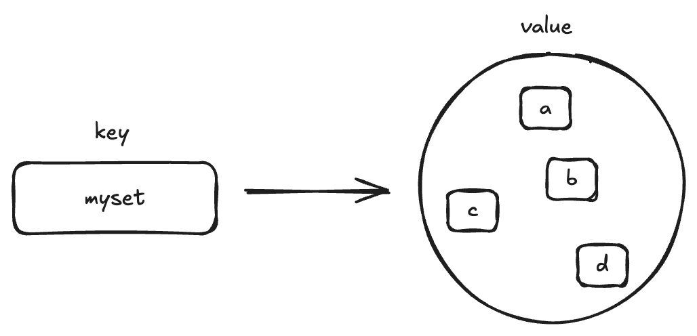

# set



## 1. set 기본 개념

레디스에서 `set` 은 정렬되지 않은 문자열 모음입니다. 위 그림과 같이 하나의 `set` 자료구조 내에서 아이템은 중복해서 저장되지 않으며, 교집합, 합집합, 차집합 등의 집합 연산과 관련된 command 를 제공해 다음과 같은 작업시 사용 가능합니다.

1. 객체간의 관계를 계산
2. 유일한 원소를 구해야 할 경우

## 2 commands

### SADD

`SADD` 연산을 통해서 집합 내부에 단일 값 또는 여러 값을 저장할 수 있습니다. 이때 중복된 원소를 넣더라도 내부에서 중복된 원소는 제거 됩니다.

```bash
sadd myset a
(integer) 1

sadd myset a a b b d d c c c c
(integer) 3
```

### SMEMBERS

`SMEMBERS` 연산을 통해 특정 집합에 속한 모든 원소를 조회할 수 있습니다.

```bash
smembers myset
1) "a"
2) "b"
3) "d"
4) "c"
```

각 원소를 중복해서 넣었지만 중복된 원소가 제가된 것을 확인할 수 있습니다.

### SREM

`SREM` 연산을 통해 집합 내부에 특정 원소를 제거할 수 있습니다.

```bash
srem myset a
(integer) 1

smembers myset
1) "b"
2) "d"
3) "c"
```

만약 없는 원소를 제거할 경우 아무일도 일어나지 않습니다.

```bash
srem myset k
(integer) 0
```

### SPOP

`SPOP` 연산은 `SREM` 과 다르게 `set` 내부의 특정 랜덤한 원소를 반환하며 해당 원소를 `SET` 에서 제거합니다.

```bash
spop myset
"c"

smembers myset
1) "b"
2) "d"
```

### SUNION, SINTER, SDIFF

`SUNION` , `SINTER` `SDIFF` 는 각각 합집합, 교집합, 차집합 연산을 지원하는 command 입니다.
`set:111` 에 원소 a, b, c, d, 그리고 `set:222` 에 원소 c, d, e ,f 를 넣은 후 위 연산을 진행해보도록 하겠습니다.

```bash
sadd set:111 a b c d
(integer) 4
 
sadd set:222 c d e f
(integer) 4

sunion set:111 set:222
1) "b"
2) "d"
3) "c"
4) "e"
5) "a"
6) "f"

sinter set:111 set:222
1) "c"
2) "d"

sdiff set:111 set:222
1) "a"
2) "b"
```

위 결과와 같이 각각 합집합, 교집합, 차집합 연산이 잘 수행된 것을 확인할 수 있습니다.