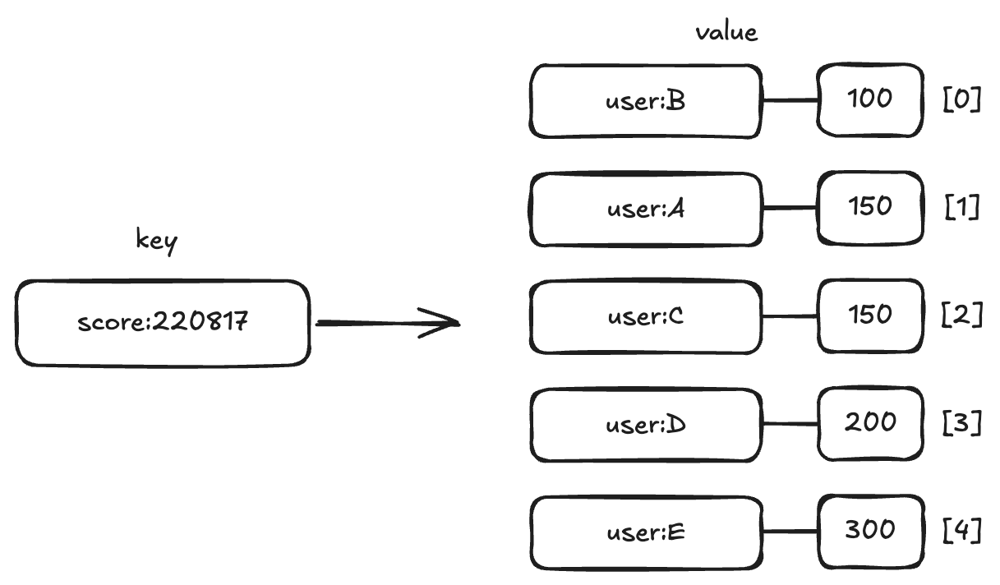

# sorted set



## 5.1 sorted set 기본 개념

redis 에서 sorted set 은 score 값에 따라 정렬되는 고유한 문자열 집합입니다. 위 그림과 같이 모든 아이템은 `score - value` 쌍을 가지며, 저장될 때 부터 score 값으로 정렬돼 저장됩니다. 같은 score 값을 가진 아이템은 데이터의 사전 순으로 정렬돼 저장됩니다.

데이터는 중복없지 저장되므로 `set` 과 유사하다고 볼 수 있으며 각 아이템은 score 라는 데이터에 연결되어 이써 이 점에서 hash 와 유사하다고 볼 수 있습니다.  또한 모든 아이템은 score 순으로 정렬되어 있어 list 처럼 index 를 이용해 각 item 에 접근할 수 있습니다.

> [!NOTE]
> list 와 sorted set 은 모두 index 로 접근할 수 있습니다.  만약 index 를 통해 아이템에 접근할 일이 많을 경우 sorted set 을 사용하는 것을 추천합니다.
> list 는 index 로 접근할 때 시간 복잡도가 $O(N)$ 이지만 sorted set 의 시간 복잡도는 $O(logN)$ 이기 때문입니다.
> 

## 5.2 commands

### ZADD

`ZADD` 를 사용할 경우 `sorted set` 에 아이템을 저장할 수 있으며 `score - value` 형태로 값을 저장해야 합니다. 또한 한번에 여러 값을 넣을 수 있으며 각 아이템은 `sorted set` 에 저장되는 동시에 score 값으로 정렬됩니다.


```bash
zadd score:220817 100 user:B 150 user:A 150 user:C 200 user:D 300 user:E
(integer) 5
```

만약 저장하고자 하는 데이터가 이미 `sorted set` 에 있을 경우 score 만 업데이트 되며, 업데이트 된 score 에 의해 아이템들이 재정렬됩니다.

`ZADD` 연산이 지원하는 옵션은 다음과 같습니다.
- `XX` : 아이템이 이미 존재할 때에만 score 업데이트
- `NX` : 아이템이 존재하지 않을 때만 신규 삽입. 기존 아이템 score 업데이트 안함
- `LT` : 업데이트하고자 하는 score 가 기존 아이템의 score 보다 작을때만 업데이트. 기존에 아이템이 존재하지 않을 경우 삽입
- `GT` : 업데이트하고자 하는 데이터가 기존 아이템의 score 보다 클때만 업데이트. 기존에 아이템이 존재하지 않을 경우 삽입


### ZRANGE

`ZRANGE` 명령을 사용하면 `sorted set` 에 저장된 데이터를 조회할 수 있으며, start 와 stop 이라는 범위를 항상 입력해야 합니다.

**기본 양식**

```bash
ZRANGE key start stop [BYSCORE | BYLEX] [REV] [LIMIT offset count] [WITHSCORES] 
```

이때 여러가지 옵션을 이용해 다양한 조건으로 데이터를 검색할 수 있습니다. 

**index 기반 조회**

`ZRANGE` 커맨드는 기본적으로 index 를 기반으로 데이터를 조회힙니다. 따라서 start 와 stop 인자에는 검색하고자하는 첫번째 index 와 마지막 index 를 전달합니다. 

`WITHSCORES` 옵션을 사용하면 데이터와 함께 score 값이 차례로 출력되며 , REV 옵션을 사용할 경우 역순으로 출력됩니다.

```bash
zrange score:220817 0 3 withscores
1) "user:B"
2) "100"
3) "user:A"
4) "150"
5) "user:C"
6) "150"
7) "user:D"
8) "200"
   
zrange score:220817 0 3 withscores rev
1) "user:E"
2) "300"
3) "user:D"
4) "200"
5) "user:C"
6) "150"
7) "user:A"
8) "150"
   
zrange score:220817 0 -1 withscores
 1) "user:B"
 2) "100"
 3) "user:A"
 4) "150"
 5) "user:C"
 6) "150"
 7) "user:D"
 8) "200"
 9) "user:E"
10) "300"
```

**score 기반 데이터 조회**

`ZRANGE` command 사용시 `BYSCORE` 옵션을 사용할 경우 score 를 통해서 데이터를 조회할 수 있습니다. start 와 stop 인자 값으로는 조회하고자 하는 최소, 최대 score 를 전달해야 하며, 전달한 score 를 포함한 값을 조회 합니다.

예를 들어 100, 150 을 전달할 경우 100 이상 150 이하인 값을 조회하게 됩니다.

```bash
zrange score:220817 100 150 byscore withscores
1) "user:B"
2) "100"
3) "user:A"
4) "150"
5) "user:C"
6) "150"
```

만약 해당 범위에 속하지 않는 값만 조회하고 싶을 경우 `(` 를 score 앞에 추가 하면 됩니다.

```bash
zrange score:220817 (100 150 byscore withscores ## 100 초과
1) "user:A"
2) "150"
3) "user:C"
4) "150"
   
zrange score:220817 100 (150 byscore withscores ## 150 미만
1) "user:B"
2) "100"
```

score 에서 최대값과 최소값을 표현하기 위해 `infinity` 를 의미하는 `-inf` `+inf` 라는 값을 사용합니다. 다음 예제는 score 가 200 보다 큰 모든 값을 출력하는 예제입니다.

```bash
zrange score:220817 (200 +inf byscore withscores
1) "user:E"
2) "300"
```

`ZRANGE <key> 0 -1` 과 마찬가지고 `ZRANGE <key> -inf +inf byscore` 는 sorted set 에 포함된 모든 원소를 조회하겠다는 의미 입니다.

```bash
zrange score:220817 -inf +inf byscore
1) "user:B"
2) "user:A"
3) "user:C"
4) "user:D"
5) "user:E"
```

만약 score 를 이용해 아이템을 역순으로 조회하고 싶을 경우, `REV` command 를 사용할 수 있습니다. 다만 최솟값과 최댓값 score 의 전달 순서는 변경해야 합니다.

```bash
zrange score:220817 +inf 200  byscore withscores rev
1) "user:E"
2) "300"
3) "user:D"
4) "200"
```

> [!NOTE]
> redis 의 `ZRANGE` 명령은 항상 start 지점에서 stop 지점으로 데이터를 탐색합니다.  기본 (Ascending) 일 경우 낮은 점수 -> 높은 점수 방향으로 탐색하게 됩니다.
> REV 일 경우 높은 점수 -> 낮은 점수 방향으로 탐색합니다. 탐색 시작점이 높은 지점이어야 하기 때문에 start 와 stop 전달 순서를 변경해야 합니다.


**사전순으로 데이터 조회**

앞서 `sorted set` 은 저장할 때 다음과 같이 저장한다고 말했습니다.

- 먼저 score 기반 정렬해서 저장
- score 가 동일하다면 사전순으로 저장

이러한 특성을 이용해서 score 가 같을 때, `BYLEX` 옵션을 사용하면 사전식 순서를 이용해 특정 아이템을 조회할 수 있습니다

```bash
zadd mysortedset 0 apple 0 banana 0 candy 0 dream 0 egg 0 frog
(integer) 6

zrange mysortedset (banana (f BYLEX
1) "candy"
2) "dream"
3) "egg"

zrange mysortedset [banana (f BYLEX
1) "banana"
2) "candy"
3) "dream"
4) "egg"
```

start 와 stop 에는 사전순으로  비교하기 위한 문자열을 전달해야 하며, 이때 반드시 `(` 또는 `[` 를 전달해야 합니다.
- `[` : 입력한 문자 포함
- `(` : 입력한 문자 미포함


사전식 문자열의 가장 처음은 `-` 문자로 가장 마지막은 `+` 입니다.  만약 전체를 조회하고 싶을 경우 다음과 같이 할 수 있습니다.

```bash
zrange mysortedset - + BYLEX
1) "apple"
2) "banana"
3) "candy"
4) "dream"
5) "egg"
6) "frog"
```