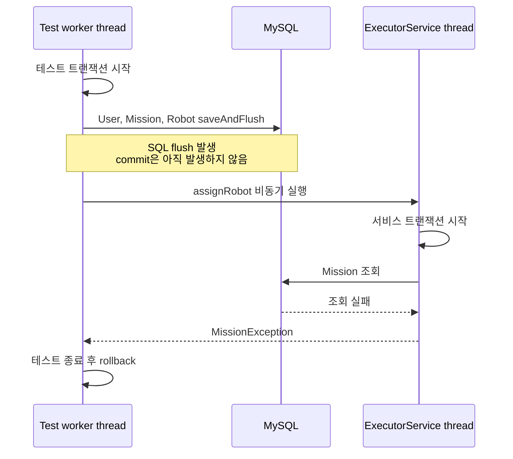
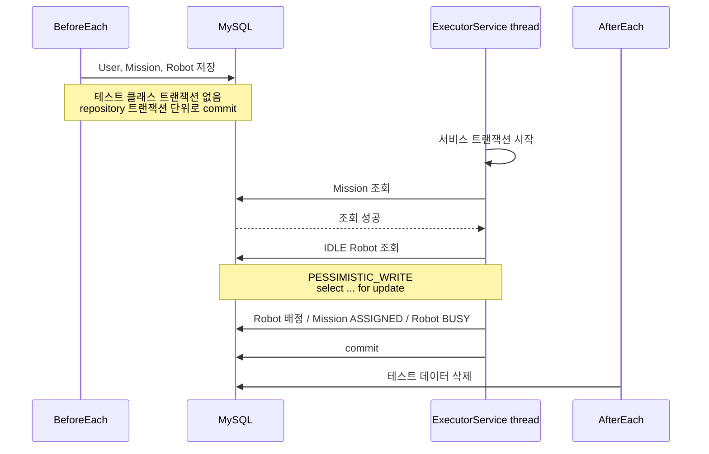

# 비관적 락 동시성 테스트가 실패한 이유: `saveAndFlush()`와 `commit`은 다르다

## 문제를 만난 배경

로봇 배정 로직의 동시성 제어를 검증하기 위해 통합 테스트를 작성하고 있었습니다.

여러 사용자가 동시에 로봇을 호출하더라도 하나의 로봇은 하나의 미션에만 배정되어야 했습니다. 예를 들어 사용자 10명이 동시에 로봇을 호출하고, 배차 가능한 로봇이 5대만 존재한다면 5개의 요청만 성공하고 나머지 5개의 요청은 실패해야 합니다.

이를 보장하기 위해 로봇 조회 시 비관적 락을 사용하도록 배정 로직을 구현했습니다.

```java
public interface RobotRepository extends JpaRepository<Robot, Long> {

    @Lock(LockModeType.PESSIMISTIC_WRITE)
    Optional<Robot> findFirstByRobotStatusOrderByIdAsc(RobotStatus robotStatus);
}
```

서비스 계층에서는 배차 가능한 `IDLE` 상태의 로봇을 조회할 때 해당 메서드를 사용했습니다.

```java
Robot robot = robotRepository.findFirstByRobotStatusOrderByIdAsc(RobotStatus.IDLE)
        .orElseThrow(() -> new RobotException(RobotErrorCode.AVAILABLE_ROBOT_NOT_FOUND));
```

즉, 동시에 여러 요청이 들어오더라도 하나의 트랜잭션이 특정 로봇 row를 선점하면 다른 트랜잭션은 같은 로봇을 동시에 배정하지 못하도록 설계했습니다.

테스트 시나리오는 다음과 같았습니다.

- 사용자 10명 생성
- 사용자별 미션 10건 생성
- 배차 가능한 로봇 5대 생성
- 10개의 로봇 배정 요청을 동시에 실행

기대 결과는 다음과 같았습니다.

```
성공: 5건
실패: 5건
```

하지만 실제로 테스트를 실행해보니 기대와 다른 결과가 나왔습니다.

```
성공: 0건
실패: 10건
```

모든 로봇 배정 요청이 실패했습니다.

---

## 기존 테스트 구조

처음에는 로봇 배정 관련 테스트를 하나의 `RobotServiceTest` 안에 모두 작성했습니다.

```java
class RobotServiceTest extends IntegrationTestSupport {

    @Test
    void assignRobot() {
        // 일반 로봇 배정 테스트
    }

    @Test
    void assignRobotWithoutAvailableRobot() {
        // 배정 가능한 로봇이 없을 때 예외 테스트
    }

    @Test
    void assignRobotConcurrently() {
        // 사용자 10명, 로봇 5대 동시 배정 테스트
    }
}
```

공통 통합 테스트 클래스인 `IntegrationTestSupport`에는 `@Transactional`이 적용되어 있었습니다.

```java
@SpringBootTest
@Transactional
@ActiveProfiles("test")
public abstract class IntegrationTestSupport {
}
```

이 구조는 일반적인 서비스 통합 테스트에서는 편리했습니다. 테스트가 끝나면 테스트 트랜잭션이 rollback되기 때문에 테스트 데이터를 직접 정리하지 않아도 되기 때문입니다.

하지만 동시성 테스트에서는 이 구조가 문제가 되었습니다.

`RobotServiceTest`가 `IntegrationTestSupport`를 상속하고 있었기 때문에 동시성 테스트 메서드도 테스트 트랜잭션 안에서 실행되었습니다. 또한 `@BeforeEach`나 테스트 내부에서 저장한 `User`, `Mission`, `Robot` 데이터도 같은 테스트 트랜잭션 안에 묶였습니다.

구조를 단순화하면 다음과 같습니다.

```
RobotServiceTest
-> IntegrationTestSupport 상속
-> @Transactional 적용
-> 테스트 메서드 시작 시 테스트 트랜잭션 생성
-> 테스트 데이터 저장
-> saveAndFlush()로 SQL 실행
-> commit은 발생하지 않음
```

---

## 이상 동작

테스트 메서드 안에서 데이터를 조회했을 때는 사용자, 미션, 로봇 데이터가 정상적으로 저장되어 있었습니다.

```
mission size = 10
robot size = 5
```

하지만 `ExecutorService`로 실행한 별도 스레드에서 로봇 배정 서비스가 실행되면 미션을 찾지 못했습니다.

```
com.e101.carry_porter.domain.mission.exception.MissionException: 미션을 찾을 수 없습니다.
    at com.e101.carry_porter.domain.robot.service.RobotService.assignRobot(RobotService.java:39)
```

결과적으로 10개의 요청은 모두 로봇 배정까지 도달하지 못하고, 미션 조회 단계에서 실패했습니다.

이상했던 점은 분명 `saveAndFlush()`로 테스트 데이터를 저장했고, 테스트 메서드 안에서는 해당 데이터가 조회되었다는 것입니다.

그런데 왜 별도 스레드에서 실행된 서비스 로직에서는 같은 미션 데이터를 조회하지 못했는지 확인이 필요했습니다.

---

## 원인 분석을 위한 로그 설정

원인을 확인하기 위해 test profile의 `application-test.yml`에 트랜잭션 로그를 활성화했습니다.

```yaml
logging:
  level:
    org.springframework.transaction.interceptor: ${TEST_LOG_TRANSACTION_INTERCEPTOR:TRACE}
    org.springframework.orm.jpa.JpaTransactionManager: ${TEST_LOG_JPA_TRANSACTION_MANAGER:DEBUG}
    org.springframework.transaction: ${TEST_LOG_SPRING_TRANSACTION:TRACE}
    org.hibernate.engine.transaction.internal.TransactionImpl: ${TEST_LOG_HIBERNATE_TRANSACTION:DEBUG}
```

이 설정을 통해 다음 내용을 확인하고자 했습니다.

- 테스트 메서드 실행 시점에 트랜잭션이 생성되는지
- `@BeforeEach`가 테스트 트랜잭션 안에서 실행되는지
- `saveAndFlush()`가 새로운 트랜잭션을 여는지, 기존 트랜잭션에 참여하는지
- 실제 commit이 발생하는지
- 서비스 메서드가 별도 트랜잭션에서 실행되는지

---

## 로그 분석

먼저 테스트 메서드가 실행되기 전에 테스트 트랜잭션이 생성되는 것을 확인했습니다.

```
Creating new transaction with name [RobotServiceConcurrencyTest.assignRobotConcurrently]: PROPAGATION_REQUIRED,ISOLATION_DEFAULT
Opened new EntityManager [SessionImpl(...)] for JPA transaction
begin
```

이후 `@BeforeEach` 내부에서 트랜잭션 상태를 출력해보니 이미 트랜잭션이 활성화되어 있었습니다.

```
BeforeEach active = true
BeforeEach rollback = true
```

즉, `@BeforeEach`에서 생성한 테스트 데이터는 별도의 독립적인 데이터가 아니라 테스트 메서드에 열린 트랜잭션 안에서 저장되고 있었습니다.

`saveAndFlush()`를 호출했을 때도 새로운 트랜잭션이 생성된 것이 아니라 기존 테스트 트랜잭션에 참여하고 있었습니다.

```
Found thread-bound EntityManager [SessionImpl(...)] for JPA transaction
Participating in existing transaction
Getting transaction for [SimpleJpaRepository.saveAndFlush]
```

그리고 실제 insert SQL도 실행되었습니다.

```
insert
into
    missions
    (created_at, mission_status, robot_id, updated_at, user_id)
values
    (?, ?, ?, ?, ?)
```

하지만 여기서 중요한 점은 commit 로그가 없었다는 것입니다.

`saveAndFlush()`는 SQL을 DB에 전달했지만, 테스트 트랜잭션 자체를 commit하지는 않았습니다. 따라서 테스트 메서드 안에서는 데이터가 조회되지만, 아직 다른 트랜잭션에서는 볼 수 없는 상태였습니다.

---

## 원인 발견: 기존 트랜잭션 경계

기존 테스트 구조의 트랜잭션 경계는 다음과 같았습니다.



문제의 핵심은 `flush`와 `commit`을 혼동했다는 점이었습니다.

`saveAndFlush()`는 SQL을 DB에 전달합니다. 하지만 트랜잭션을 commit하지는 않습니다. 같은 트랜잭션 안에서는 flush된 데이터를 조회할 수 있지만, 다른 트랜잭션에서는 commit되지 않은 데이터를 볼 수 없습니다.

동시성 테스트에서는 `ExecutorService`를 사용해 별도 스레드에서 `robotService.assignRobot()`을 호출했습니다. 별도 스레드에서 실행된 서비스 메서드는 테스트 트랜잭션에 참여하지 않고, 자신의 서비스 트랜잭션에서 실행되었습니다.

따라서 테스트 트랜잭션 안에서 아직 commit되지 않은 `Mission` 데이터를 조회할 수 없었습니다.

정리하면 다음과 같습니다.

```
Test worker thread
-> 테스트 트랜잭션 생성
-> 테스트 데이터 saveAndFlush
-> flush만 발생, commit은 없음

ExecutorService thread
-> robotService.assignRobot()
-> 서비스 트랜잭션 생성
-> Mission 조회
-> 미커밋 데이터 조회 불가
-> MissionException 발생
```

---

## 해결 방법 비교

문제를 해결하려면 테스트 데이터가 별도 스레드의 서비스 트랜잭션에서도 조회 가능해야 했습니다.

이때 가장 중요하게 본 기준은 “지금 이 테스트 하나를 통과시키는가”가 아니었습니다. 앞으로 같은 성격의 동시성 테스트를 작성할 때도 같은 해결책을 반복 없이 재사용할 수 있는지가 더 중요했습니다.

가능한 해결 방법을 비교하면 다음과 같았습니다.

| 대안 | 기각/선택 근거 | 재사용성 |
| --- | --- | --- |
| `@Commit` | 테스트 메서드 종료 후 commit되므로, 별도 스레드 실행 전에 데이터가 보여야 하는 이번 문제의 시점과 맞지 않음 | 테스트마다 반복 적용 필요 |
| `TestTransaction` | 원하는 시점에 commit할 수 있지만, 테스트마다 commit/end/start 시점을 수동 관리해야 함 | 테스트마다 반복 적용 필요 |
| `REQUIRES_NEW` | setup 로직을 `REQUIRES_NEW` 메서드로 분리하더라도 같은 테스트 클래스 내부에서 호출하면 self-invocation으로 프록시를 거치지 않으므로, 별도 Bean 분리가 필요함 | 테스트마다 구조 추가 필요 |
| 테스트 클래스 분리 | 테스트 성격에 따라 트랜잭션 경계가 명확히 분리됨 | support class 상속만으로 재사용 가능 |

최종적으로 테스트 클래스 분리 방식을 선택했습니다.

일반적인 서비스 테스트는 rollback 기반 구조가 편리합니다. 반면 동시성 테스트는 별도 스레드에서 조회 가능한 실제 commit 데이터가 필요합니다.

따라서 특정 테스트 메서드에 트랜잭션 제어 코드를 추가하는 대신, 테스트 성격에 따라 support class를 분리하기로 했습니다.

---

## 수정된 테스트 구조

먼저 `IntegrationTestSupport`에서 `@Transactional`을 제거했습니다.

```java
@SpringBootTest
@ActiveProfiles("test")
@RecordApplicationEvents
public abstract class IntegrationTestSupport {
}
```

그리고 rollback이 필요한 일반적인 통합 테스트를 위해 별도의 support class를 만들었습니다.

```java
@Transactional
public abstract class TransactionalIntegrationTestSupport extends IntegrationTestSupport {
}
```

이후 테스트 성격에 따라 상속 구조를 분리했습니다.

```java
class RobotServiceTest extends TransactionalIntegrationTestSupport {
    // 일반 서비스 테스트
}
```

```java
class RobotServiceConcurrencyTest extends IntegrationTestSupport {
    // 동시성 테스트
}
```

이렇게 분리하면 일반 서비스 테스트는 기존처럼 테스트 종료 후 rollback됩니다.

반면 동시성 테스트는 테스트 클래스 자체에 테스트 트랜잭션이 걸리지 않기 때문에, `@BeforeEach`에서 저장한 데이터가 repository 메서드 단위 트랜잭션으로 commit될 수 있습니다. 따라서 별도 스레드에서 실행되는 서비스 로직도 해당 데이터를 조회할 수 있습니다.

여기서 중요한 점은 `@BeforeEach`에 별도의 `@Transactional`을 붙이지 않아도 데이터가 commit된다는 점입니다.

Spring Data JPA의 `save`, `saveAndFlush` 같은 repository 변경 메서드는 기본적으로 트랜잭션 안에서 실행됩니다. 따라서 바깥에 테스트 트랜잭션이 없으면 repository 메서드가 자체적으로 트랜잭션을 시작하고, 메서드 호출이 끝나는 시점에 commit합니다.

반대로 기존 구조처럼 테스트 클래스에 `@Transactional`이 걸려 있으면 repository 메서드는 새로운 트랜잭션을 만들지 않고 기존 테스트 트랜잭션에 참여합니다. 그래서 테스트 메서드가 끝나기 전까지 commit되지 않습니다.

수정 후 로그에서도 setup 데이터가 실제 commit되는 것을 확인할 수 있었습니다.

먼저 `@BeforeEach` 시점에 테스트 트랜잭션이 활성화되어 있지 않았습니다.

```text
2026-06-10T23:06:23.141+09:00  INFO ... RobotServiceConcurrencyTest : setup 로직 시작
2026-06-10T23:06:23.141+09:00  INFO ... RobotServiceConcurrencyTest : BeforeEach active = false
2026-06-10T23:06:23.141+09:00  INFO ... RobotServiceConcurrencyTest : 테스트용 사용자와 미션 저장
```

이후 `saveAndFlush()` 호출 시 repository 메서드가 자체적으로 트랜잭션을 생성했습니다.

```text
Creating new transaction with name [org.springframework.data.jpa.repository.support.SimpleJpaRepository.saveAndFlush]: PROPAGATION_REQUIRED,ISOLATION_DEFAULT
Getting transaction for [org.springframework.data.jpa.repository.support.SimpleJpaRepository.saveAndFlush]
```

그리고 `users` insert 후 바로 commit이 발생했습니다.

```sql
insert
into
    users
    (created_at, updated_at, username)
values
    (?, ?, ?)
```

```text
Completing transaction for [org.springframework.data.jpa.repository.support.SimpleJpaRepository.saveAndFlush]
Initiating transaction commit
Committing JPA transaction on EntityManager [SessionImpl(1338252474<open>)]
committing
```

`missions` 저장도 동일하게 insert 후 commit되었습니다.

```sql
insert
into
    missions
    (created_at, mission_status, robot_id, updated_at, user_id)
values
    (?, ?, ?, ?, ?)
```

```text
Completing transaction for [org.springframework.data.jpa.repository.support.SimpleJpaRepository.saveAndFlush]
Initiating transaction commit
Committing JPA transaction on EntityManager [SessionImpl(873287880<open>)]
committing
```

즉, 테스트 클래스 레벨의 `@Transactional`을 제거한 뒤에는 setup 데이터가 repository 메서드 단위 트랜잭션으로 실제 commit되었습니다. 그래서 `ExecutorService`의 별도 스레드에서 실행된 서비스 트랜잭션도 해당 데이터를 정상적으로 조회할 수 있었습니다.

---

## 변경된 트랜잭션 경계

수정 후 동시성 테스트의 트랜잭션 경계는 다음과 같이 바뀌었습니다.



이제 테스트 데이터는 별도 스레드에서 실행되는 서비스 트랜잭션에서도 조회 가능한 상태가 되었습니다.

---

## 비관적 락 동작 확인

트랜잭션 경계를 수정한 뒤에는 서비스 로직이 미션 조회 단계에서 실패하지 않고, 실제 로봇 조회 단계까지 도달했습니다.

그리고 로그에서 비관적 락이 실제 SQL에 반영된 것을 확인할 수 있었습니다.

```
2026-06-10T23:06:23.598+09:00 TRACE ...
Getting transaction for [SimpleJpaRepository.findFirstByRobotStatusOrderByIdAsc]
```

```
select
    r1_0.robot_id,
    r1_0.created_at,
    r1_0.mac_address,
    r1_0.robot_status,
    r1_0.updated_at
from
    robots r1_0
where
    r1_0.robot_status=?
order by
    r1_0.robot_id
limit
    ? for update
```

여기서 `for update`가 붙었다는 것은 JPA의 `@Lock(LockModeType.PESSIMISTIC_WRITE)`가 실제 MySQL 쿼리에 반영되었다는 의미입니다.

즉, 단순히 코드에 비관적 락 어노테이션을 붙인 것에서 끝난 것이 아니라, 실제 DB 쿼리에서도 row lock을 획득하는 형태로 실행되고 있음을 확인했습니다.

---

## 테스트 성공

최종 테스트는 다음과 같이 작성했습니다.

```java
@Test
@DisplayName("사용자 10명과 로봇 5대가 있을 때 동시에 배정 요청이 들어오면 5건만 성공한다")
void assignRobotConcurrently() throws InterruptedException {
    ExecutorService executorService = Executors.newFixedThreadPool(32);
    CountDownLatch latch = new CountDownLatch(USER_COUNT);
    AtomicInteger successCount = new AtomicInteger();
    AtomicInteger failureCount = new AtomicInteger();

    for (int i = 0; i < USER_COUNT; i++) {
        Long missionId = fixture.missionIds().get(i);

        executorService.execute(() -> {
            try {
                robotService.assignRobot(new AssignRobotServiceRequest(missionId));
                successCount.incrementAndGet();
            } catch (Exception exception) {
                failureCount.incrementAndGet();
            } finally {
                latch.countDown();
            }
        });
    }

    latch.await();

    assertThat(successCount.get()).isEqualTo(ROBOT_COUNT);
    assertThat(failureCount.get()).isEqualTo(USER_COUNT - ROBOT_COUNT);
}
```

결과는 기대한 대로 나왔습니다.

```
successCount = 5
failureCount = 5
```

이로써 사용자 10명이 동시에 로봇 배정을 요청하더라도, 배차 가능한 로봇 5대만 정상 배정되고 나머지 요청은 실패하는 것을 확인했습니다.

또한 SQL 로그를 통해 실제 로봇 조회 쿼리에 `for update`가 적용되는 것도 확인했습니다.

---

## 배운 점

이번 문제는 비관적 락 자체의 문제가 아니라, 동시성 테스트를 구성하는 트랜잭션 경계가 실제 실행 환경과 다르게 잡혀 있었기 때문에 발생했습니다.

특히 동시성 테스트에서는 테스트 편의를 위한 rollback 트랜잭션이 오히려 검증을 방해할 수 있다는 점을 배웠습니다.

앞으로 동시성 테스트를 작성할 때는 다음을 먼저 확인해야겠다고 느꼈습니다.

- 테스트 데이터가 별도 스레드에서 조회 가능하도록 commit되어 있는가?
- 테스트 코드와 서비스 코드가 같은 트랜잭션에서 실행되는가?
- `ExecutorService`로 실행한 로직은 어떤 스레드와 트랜잭션에서 실행되는가?
- `saveAndFlush()`를 commit으로 착각하고 있지는 않은가?
- 테스트 종료 후 데이터 정리는 rollback에 의존할 것인가, 직접 정리할 것인가?
- 락을 적용했다면 실제 SQL에 `for update` 같은 락 쿼리가 반영되는지 확인했는가?

결국 이 문제를 통해 단순히 테스트 하나를 고친 것이 아니라, 동시성 테스트에서는 테스트 트랜잭션과 서비스 트랜잭션의 경계를 의도적으로 설계해야 한다는 점을 배웠습니다.
