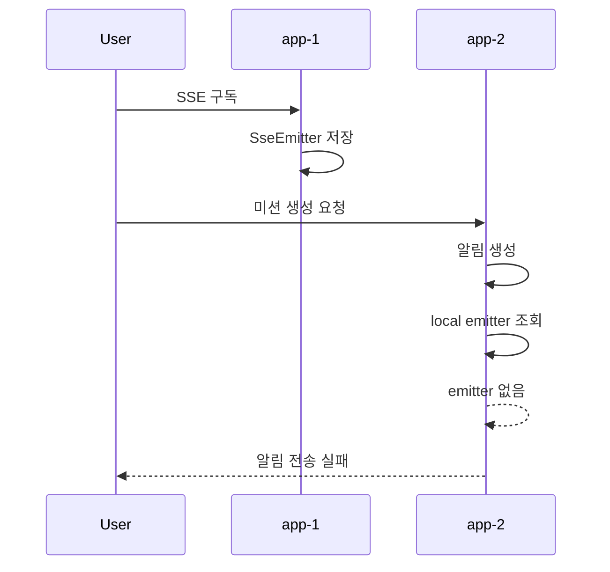
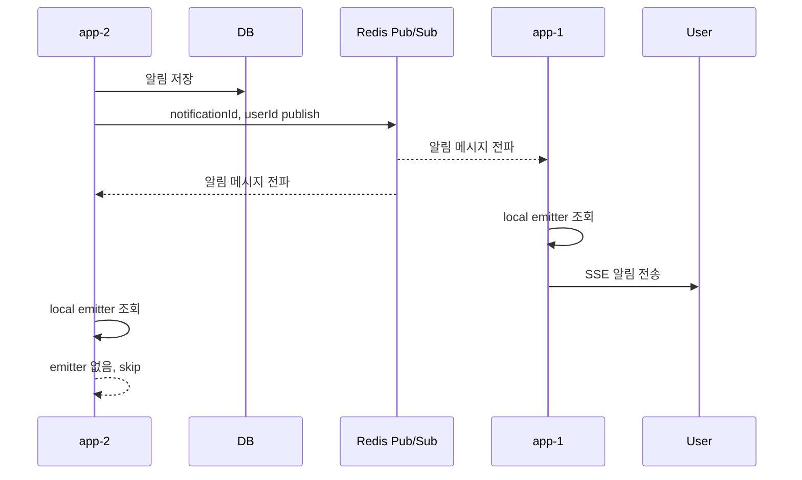

## 문제를 만난 배경

SSE를 이용해 사용자에게 미션 진행 상태를 실시간으로 전달하고 있었습니다.

단일 Spring Boot 인스턴스에서는 사용자가 SSE를 구독하고, 서버에서 알림이 생성되면 정상적으로 실시간 알림이 전달되었습니다.

하지만 Spring Boot 인스턴스를 `app-1`, `app-2` 두 대로 띄운 뒤 문제가 발생했습니다.

사용자는 `app-1`에 SSE 구독을 맺고, 미션 생성 요청은 `app-2`로 보내는 시나리오를 테스트했습니다. 기대한 결과는 `app-2`에서 생성된 알림이 `app-1`에 연결된 SSE 구독자에게 실시간으로 전달되는 것이었습니다.

하지만 실제로는 알림이 전달되지 않았습니다.

---

## 재현 시나리오

재현 시나리오는 다음과 같았습니다.

1. Spring Boot 인스턴스 `app-1`, `app-2` 실행
2. 사용자는 `app-1`에 SSE 구독 요청
3. 미션 생성 요청은 `app-2`로 전송
4. `app-2`에서 미션 생성 및 알림 생성
5. `app-2`가 사용자 SSE 연결을 조회한 뒤 알림 전송 시도

구조로 보면 다음과 같습니다.



---

## 증상

먼저 `app-1`에는 SSE 연결이 정상적으로 생성되었습니다.

```text
carry-porter-app-1 | 2026-06-20T06:56:07.649Z INFO ... NotificationController : SSE 구독 요청: userId = 1, username = multi-user, lastEventId = null
carry-porter-app-1 | 2026-06-20T06:56:07.657Z INFO ... NotificationService    : 연결 완료 이벤트 전송: userId = 1
```

이후 미션 생성 요청은 `app-2`에서 정상 처리되었습니다.

```text
carry-porter-app-2 | 2026-06-20T06:56:25.103Z INFO ... MissionService : mission 생성 요청: userId = 1
carry-porter-app-2 | 2026-06-20T06:56:25.135Z INFO ... MissionService : mission 생성 완료: userId = 1, missionId = 1
carry-porter-app-2 | 2026-06-20T06:56:25.136Z INFO ... MissionService : MissionCreatedEvent 발행 완료: missionId = 1
```

문제는 알림 전송 단계에서 발생했습니다.

```text
carry-porter-app-2 | 2026-06-20T06:56:25.182Z INFO ... NotificationDispatchEventListener : NotificationCreatedEvent 수신: notificationId = 1, userId = 1
carry-porter-app-2 | 2026-06-20T06:56:25.187Z INFO ... NotificationService              : 활성화된 SSE 연결이 없어 알림 전송을 건너뜁니다: userId = 1, eventType = ROBOT_ASSIGNED

carry-porter-app-2 | 2026-06-20T06:56:25.193Z INFO ... NotificationDispatchEventListener : NotificationCreatedEvent 수신: notificationId = 2, userId = 1
carry-porter-app-2 | 2026-06-20T06:56:25.196Z INFO ... NotificationService              : 활성화된 SSE 연결이 없어 알림 전송을 건너뜁니다: userId = 1, eventType = MISSION_STARTED
```

알림은 정상적으로 생성되었습니다. 하지만 알림을 생성한 `app-2`에는 사용자의 SSE 연결이 없었기 때문에 전송이 실패했습니다.

---

## 원인 분석

원인은 `SseEmitter`가 Spring Boot 인스턴스 메모리에 저장되는 객체라는 점이었습니다.

현재 SSE 연결은 `userId`를 기준으로 인메모리 저장소에 보관하고 있었습니다.

```java
@Repository
public class NotificationEmitterRepository {

    private final Map<Long, SseEmitter> emitters = new ConcurrentHashMap<>();

    public Optional<SseEmitter> findByUserId(Long userId) {
        return Optional.ofNullable(emitters.get(userId));
    }

    public void save(Long userId, SseEmitter emitter) {
        emitters.put(userId, emitter);
    }

    public void delete(Long userId, SseEmitter emitter) {
        emitters.computeIfPresent(userId, (key, currentEmitter) ->
                currentEmitter == emitter ? null : currentEmitter
        );
    }
}
```

사용자가 `app-1`에 SSE 구독을 맺으면 `app-1`의 메모리에만 `SseEmitter`가 저장됩니다. 이 연결 정보는 `app-2`와 공유되지 않습니다.

따라서 `app-2`에서 알림이 생성되면 `app-2`는 자기 메모리에서 emitter를 찾습니다. 하지만 실제 emitter는 `app-1`에 있으므로 조회에 실패합니다.

정리하면 다음과 같습니다.

```text
SSE 연결 위치: app-1
알림 생성 위치: app-2
app-2가 조회 가능한 emitter: app-2 메모리에 있는 emitter
실제 emitter 위치: app-1 메모리
결과: app-2는 emitter를 찾지 못하고 알림 전송 실패
```

문제의 본질은 알림이 저장되지 않는 것이 아니었습니다.

알림을 생성한 인스턴스와 SSE 연결을 보유한 인스턴스가 다르다는 점이 핵심이었습니다.

---

## 해결 방향

처음에는 알림 유실 문제처럼 보였습니다. 하지만 실제로는 알림 데이터 자체가 사라진 것이 아니었습니다.

알림과 미션 상태의 원본은 이미 DB에 저장되고 있었습니다. 따라서 해결해야 할 문제는 메시지 영속성이나 재처리가 아니었습니다.

필요했던 것은 `app-2`에서 알림이 생성되었다는 사실을 `app-1`에도 알려주는 것이었습니다.

즉, 문제를 다음과 같이 분리했습니다.

```text
DB: 알림과 미션 상태의 원본 저장
SseEmitter: 각 Spring Boot 인스턴스 메모리에 저장
필요한 것: 모든 인스턴스에 알림 생성 사실을 실시간 전파
```

---

## 왜 Redis Pub/Sub을 선택했는가

가능한 해결 방법을 비교했습니다.

| 대안 | 판단 |
| --- | --- |
| Sticky Session | 같은 사용자를 같은 인스턴스로 고정하면 emitter 조회 문제는 줄어듭니다. 하지만 인스턴스 장애나 재배포 시 해당 사용자 연결이 그대로 끊기고, 로드 밸런서를 둔 목적인 부하 분산과 장애 격리 효과가 약해집니다. |
| Redis Stream | 메시지 저장, ACK, 재처리에 강하지만 현재 알림 원본은 DB에 저장되어 있습니다. 추가로 pending message, ACK, stream trimming을 관리해야 하므로 현재 문제보다 구조가 복잡해집니다. |
| RabbitMQ | fanout exchange로 전파할 수 있지만, 인스턴스별 queue와 binding, consumer 관리가 필요합니다. 단순 브로드캐스트 문제를 해결하기에는 운영 요소가 많습니다. |
| Kafka | 장기 이벤트 저장, replay, 다중 consumer group에는 적합하지만 현재 요구사항은 단순 실시간 알림 전파입니다. 파티션, offset, broker 운영까지 가져가기에는 과합니다. |
| Redis Pub/Sub | 구독 중인 모든 인스턴스에 즉시 브로드캐스트합니다. 알림과 미션 상태는 DB가 저장하므로 Redis는 실시간 전파만 담당하면 됩니다. 현재 문제에 가장 단순하고 직접적인 선택입니다. |

Redis Pub/Sub을 선택한 이유는 단순했습니다.

현재 필요한 것은 메시지 저장이나 재처리가 아니라, 살아 있는 Spring Boot 인스턴스들에게 알림 생성 사실을 즉시 전파하는 것이었습니다.

영속성은 이미 DB가 담당하고 있었기 때문에 Redis에는 전파 역할만 맡기면 충분하다고 판단했습니다.

---

## Redis Pub/Sub 적용 구조

구조는 다음과 같이 변경했습니다.

1. 알림 생성
2. 알림을 DB에 저장
3. `NotificationCreatedEvent` 발행
4. Redis channel에 `notificationId`, `userId` 발행
5. 모든 인스턴스가 Redis channel 구독
6. 각 인스턴스가 메시지 수신 후 자기 메모리에서 해당 사용자의 emitter 조회
7. emitter가 있으면 SSE 전송
8. emitter가 없으면 skip

도식화하면 다음과 같습니다.



핵심은 알림을 생성한 인스턴스가 직접 SSE 전송까지 책임지지 않도록 만든 것입니다.

알림 생성 인스턴스는 Redis에 “알림이 생성되었다”는 사실만 발행합니다. 그리고 모든 인스턴스가 이 메시지를 받아 각자 자기 메모리에 해당 사용자의 `SseEmitter`가 있는지 확인합니다.

이렇게 하면 실제 SSE 연결을 가지고 있는 인스턴스가 알림 전송을 수행할 수 있습니다.

---

## 실제 구현

### Redis 설정

Redis channel 이름은 설정값으로 분리했습니다.

```yaml
carry-porter:
  redis:
    pub-sub:
      notification-channel: ${REDIS_NOTIFICATION_CHANNEL:carry-porter:notification}
```

이후 `RedisProperties`를 통해 `carry-porter.redis` 하위 설정을 바인딩했습니다.

```java
@Getter
@Setter
@ConfigurationProperties(prefix = "carry-porter.redis")
public class RedisProperties {

    private final PubSub pubSub = new PubSub();

    @Getter
    @Setter
    public static class PubSub {
        private String notificationChannel;
    }
}
```

Redis Pub/Sub 구독은 `RedisMessageListenerContainer`로 등록했습니다.

```java
@Configuration
@RequiredArgsConstructor
@EnableConfigurationProperties(RedisProperties.class)
public class RedisConfig {

    private final ObjectMapper objectMapper;
    private final RedisProperties redisProperties;

    @Bean
    public RedisMessageListenerContainer redisMessageListenerContainer(
            RedisConnectionFactory redisConnectionFactory,
            MessageListenerAdapter notificationMessageListenerAdapter,
            ChannelTopic notificationTopic
    ) {
        RedisMessageListenerContainer container = new RedisMessageListenerContainer();
        container.setConnectionFactory(redisConnectionFactory);
        container.addMessageListener(notificationMessageListenerAdapter, notificationTopic);
        return container;
    }

    @Bean
    public ChannelTopic notificationTopic() {
        return new ChannelTopic(redisProperties.getPubSub().getNotificationChannel());
    }

    @Bean
    public MessageListenerAdapter notificationMessageListenerAdapter(
            NotificationRedisSubscriber notificationRedisSubscriber
    ) {
        MessageListenerAdapter adapter = new MessageListenerAdapter(
                notificationRedisSubscriber,
                "handleMessage"
        );
        adapter.setSerializer(new GenericJackson2JsonRedisSerializer(objectMapper));
        return adapter;
    }
}
```

여기서 핵심은 모든 인스턴스가 동일한 `carry-porter:notification` channel을 구독한다는 점입니다.

Redis 메시지는 JSON 형태로 직렬화했습니다.

```java
@Bean
public RedisTemplate<String, Object> redisTemplate(RedisConnectionFactory redisConnectionFactory) {
    RedisTemplate<String, Object> redisTemplate = new RedisTemplate<>();

    GenericJackson2JsonRedisSerializer serializer =
            new GenericJackson2JsonRedisSerializer(objectMapper);

    redisTemplate.setConnectionFactory(redisConnectionFactory);
    redisTemplate.setKeySerializer(new StringRedisSerializer());
    redisTemplate.setHashKeySerializer(new StringRedisSerializer());
    redisTemplate.setValueSerializer(serializer);
    redisTemplate.setHashValueSerializer(serializer);
    redisTemplate.afterPropertiesSet();

    return redisTemplate;
}
```

---

### Redis로 전달하는 메시지

Redis에는 알림 전체 내용을 싣지 않았습니다. 대신 `notificationId`, `userId`만 전달했습니다.

```java
public record NotificationRedisMessage(
        Long notificationId,
        Long userId
) {
}
```

이렇게 한 이유는 알림 원본이 이미 DB에 저장되어 있기 때문입니다.

Redis는 알림 내용을 저장하는 저장소가 아니라, “어떤 알림이 생성되었는지”를 인스턴스들에게 알려주는 전파 수단으로만 사용했습니다.

---

### 알림 저장 후 Redis 발행

알림이 생성되면 먼저 DB에 저장합니다.

```java
@Transactional
public void createNotification(NotificationPayload payload) {
    User user = userRepository.findById(payload.userId())
            .orElseThrow(() -> new UserException(UserErrorCode.USER_NOT_FOUND));

    Mission mission = findMissionOrNull(payload.missionId());

    Notification notification = notificationRepository.save(Notification.create(
            user,
            mission,
            payload.eventType(),
            payload.message(),
            payload.failureCode()
    ));

    eventPublisher.publishEvent(new NotificationCreatedEvent(
            notification.getId(),
            notification.getUserId()
    ));
}
```

그리고 `NotificationCreatedEvent`를 수신한 listener가 Redis Pub/Sub으로 알림 생성 사실을 발행합니다.

```java
@Slf4j
@Component
@RequiredArgsConstructor
public class NotificationDispatchEventListener {

    private final NotificationRedisPublisher notificationRedisPublisher;

    @Async("eventTaskExecutor")
    @TransactionalEventListener(phase = TransactionPhase.AFTER_COMMIT)
    public void handleNotificationCreatedEvent(NotificationCreatedEvent event) {
        notificationRedisPublisher.publish(event.notificationId(), event.userId());
    }
}
```

여기서 `@TransactionalEventListener(phase = TransactionPhase.AFTER_COMMIT)`를 사용했습니다.

알림 저장 트랜잭션이 commit되기 전에 Redis 메시지를 발행하면, 다른 인스턴스가 메시지를 수신하더라도 아직 DB에서 알림을 조회하지 못할 수 있습니다.

따라서 알림이 DB에 정상 commit된 이후 Redis로 전파되도록 했습니다.

---

### Redis Publisher

Redis 발행 코드는 단순합니다.

```java
@Slf4j
@Component
@RequiredArgsConstructor
public class NotificationRedisPublisher {

    private final RedisTemplate<String, Object> redisTemplate;
    private final ChannelTopic notificationTopic;

    public void publish(Long notificationId, Long userId) {
        NotificationRedisMessage message = new NotificationRedisMessage(notificationId, userId);

        redisTemplate.convertAndSend(notificationTopic.getTopic(), message);

        log.info("Redis Pub/Sub 알림 발행: channel = {}, notificationId = {}, userId = {}",
                notificationTopic.getTopic(), notificationId, userId);
    }
}
```

`convertAndSend()`를 통해 `carry-porter:notification` channel로 메시지를 발행합니다.

---

### Redis Subscriber

각 인스턴스는 동일한 channel을 구독하고 있다가 메시지를 수신합니다.

```java
@Slf4j
@Component
@RequiredArgsConstructor
public class NotificationRedisSubscriber {

    private final ObjectMapper objectMapper;
    private final NotificationService notificationService;

    public void handleMessage(Object message) {
        NotificationRedisMessage notificationRedisMessage = objectMapper.convertValue(
                message,
                NotificationRedisMessage.class
        );

        log.info("Redis Pub/Sub 알림 수신: notificationId = {}, userId = {}",
                notificationRedisMessage.notificationId(), notificationRedisMessage.userId());

        notificationService.dispatch(notificationRedisMessage.notificationId());
    }
}
```

Redis 메시지를 수신한 인스턴스는 `notificationId`로 DB에서 알림을 조회하고, 자기 메모리에 해당 사용자의 emitter가 있는지 확인합니다.

```java
public void dispatch(Long notificationId) {
    Notification notification = notificationRepository.findById(notificationId)
            .orElseThrow(() -> new IllegalArgumentException("알림을 찾을 수 없습니다."));

    notificationEmitterRepository.findByUserId(notification.getUserId())
            .ifPresentOrElse(
                    emitter -> sendNotificationEvent(notification.getUserId(), emitter, notification),
                    () -> log.info("활성화된 SSE 연결이 없어 알림 전송을 건너뜁니다: userId = {}, eventType = {}",
                            notification.getUserId(), notification.getEventType())
            );
}
```

즉, Redis 메시지를 받은 모든 인스턴스가 SSE 전송을 시도하는 것이 아니라, 각자 로컬 메모리에 emitter가 있는지 확인합니다.

emitter가 있는 인스턴스만 실제 SSE 알림을 전송합니다.

---

## 단일 채널과 로컬 필터링을 선택한 이유

Redis Pub/Sub channel 설계는 단일 채널 + 로컬 필터링 방식을 선택했습니다.

현재 구조에서는 모든 인스턴스가 `carry-porter:notification` channel 하나를 구독합니다. 알림 메시지를 받은 뒤 각 인스턴스가 자기 메모리에 해당 `userId`의 emitter가 있는지 확인합니다.

```text
Redis channel: carry-porter:notification

app-1 수신 -> userId emitter 있음 -> SSE 전송
app-2 수신 -> userId emitter 없음 -> skip
```

사용자별 Redis channel을 만드는 방법도 가능했습니다.

예를 들면 다음과 같습니다.

```text
carry-porter:notification:user:1
carry-porter:notification:user:2
carry-porter:notification:user:3
```

이 방식은 각 인스턴스가 자신에게 연결된 사용자 channel만 구독할 수 있다는 장점이 있습니다.

하지만 SSE 연결과 해제 시점마다 Redis subscribe/unsubscribe를 동적으로 관리해야 합니다. 즉, SSE 연결 생명주기와 Redis 구독 생명주기를 함께 관리해야 합니다.

고려해야 할 내용도 늘어납니다.

- 사용자가 재연결할 때 기존 구독이 해제되었는지 확인해야 함
- 같은 사용자가 여러 탭으로 접속할 경우 구독 중복 처리 필요
- 인스턴스별 동적 subscribe/unsubscribe 관리 필요
- 브라우저 종료나 네트워크 단절 시 unsubscribe 타이밍 보장 필요

반면 단일 채널 방식은 모든 인스턴스가 모든 알림 메시지를 수신한다는 비용이 있습니다.

하지만 현재 규모에서는 이 비용보다 구조 단순성이 더 중요하다고 판단했습니다.

따라서 Redis 구독 생명주기는 고정하고, SSE 연결 생명주기는 `NotificationEmitterRepository`의 `ConcurrentHashMap`으로만 관리하는 구조를 선택했습니다.

---

## 해결 후 검증

동일한 시나리오를 다시 실행했습니다.

먼저 `app-1`에 SSE 연결이 생성되었습니다.

```text
carry-porter-app-1 | 2026-06-20T13:10:47.227Z INFO ... NotificationController : SSE 구독 요청: userId = 1, username = multi-user, lastEventId = null
carry-porter-app-1 | 2026-06-20T13:10:47.237Z INFO ... NotificationService    : 연결 완료 이벤트 전송: userId = 1
```

이후 `app-2`에서 미션 생성과 알림 저장이 이루어졌습니다.

```text
carry-porter-app-2 | 2026-06-20T13:11:04.725Z INFO ... MissionService      : mission 생성 요청: userId = 1
carry-porter-app-2 | 2026-06-20T13:11:04.767Z INFO ... MissionService      : mission 생성 완료: userId = 1, missionId = 1
carry-porter-app-2 | 2026-06-20T13:11:04.804Z INFO ... NotificationService : 알림 저장 완료: notificationId = 1, userId = 1, eventType = ROBOT_ASSIGNED
carry-porter-app-2 | 2026-06-20T13:11:04.812Z INFO ... NotificationService : 알림 저장 완료: notificationId = 2, userId = 1, eventType = MISSION_STARTED
```

`app-2`는 Redis channel로 알림 생성 사실을 발행했습니다.

```text
carry-porter-app-2 | 2026-06-20T13:11:04.817Z INFO ... NotificationRedisPublisher : Redis Pub/Sub 알림 발행: channel = carry-porter:notification, notificationId = 1, userId = 1
carry-porter-app-2 | 2026-06-20T13:11:04.817Z INFO ... NotificationRedisPublisher : Redis Pub/Sub 알림 발행: channel = carry-porter:notification, notificationId = 2, userId = 1
```

그리고 `app-1`은 Redis 메시지를 수신한 뒤 자신이 보유한 SSE 연결을 통해 사용자에게 알림을 전송했습니다.

```text
carry-porter-app-1 | 2026-06-20T13:11:04.858Z INFO ... NotificationRedisSubscriber : Redis Pub/Sub 알림 수신: notificationId = 1, userId = 1
carry-porter-app-1 | 2026-06-20T13:11:04.858Z INFO ... NotificationRedisSubscriber : Redis Pub/Sub 알림 수신: notificationId = 2, userId = 1
carry-porter-app-1 | 2026-06-20T13:11:04.898Z INFO ... NotificationService         : SSE 알림 전송: notificationId = 1, userId = 1, eventType = ROBOT_ASSIGNED, missionId = 1
carry-porter-app-1 | 2026-06-20T13:11:04.898Z INFO ... NotificationService         : SSE 알림 전송: notificationId = 2, userId = 1, eventType = MISSION_STARTED, missionId = 1
```

이제 알림 생성 위치가 `app-2`이고 SSE 연결 위치가 `app-1`이어도, Redis Pub/Sub을 통해 알림 생성 사실이 모든 인스턴스로 전파되기 때문에 정상적으로 SSE 알림을 전송할 수 있었습니다.

---

## Redis Pub/Sub의 한계와 보완

Redis Pub/Sub은 메시지를 저장하지 않습니다.

따라서 Redis가 죽어 있거나 특정 인스턴스가 메시지를 수신하지 못하면 해당 순간의 실시간 알림은 유실될 수 있습니다.

하지만 이 프로젝트에서는 알림과 미션 상태의 원본을 DB에 저장하고 있습니다. 그래서 Redis Pub/Sub에는 메시지 영속성을 맡기지 않았습니다.

역할을 다음과 같이 분리했습니다.

```text
DB: 알림과 미션 상태의 원본 저장
Redis Pub/Sub: 살아 있는 인스턴스 간 실시간 전파
SSE 재연결: 현재 진행 중인 미션 상태 조회 후 동기화
```

SSE 재연결 시에는 이벤트 로그를 전부 재생하지 않고, 현재 진행 중인 미션 상태를 조회해 즉시 동기화하도록 했습니다.

```java
private void sendInitialMissionStateOrConnectEvent(Long userId, SseEmitter emitter) {
    missionRepository.findFirstByUserIdAndMissionStatusInOrderByIdDesc(userId, ACTIVE_MISSION_STATUSES)
            .ifPresentOrElse(
                    mission -> sendCurrentMissionStateEvent(userId, emitter, mission),
                    () -> sendConnectEvent(userId, emitter)
            );
}
```

이렇게 하면 Redis Pub/Sub의 단순함을 유지하면서도, 사용자 재접속 시 현재 상태 기준으로 복구할 수 있습니다.

---

## 배운 점

이번 문제를 통해 SSE는 단일 인스턴스에서는 단순하지만, 멀티 인스턴스 환경에서는 연결 객체의 위치를 반드시 고려해야 한다는 점을 배웠습니다.

특히 `SseEmitter`는 서버 메모리에 저장되는 객체이기 때문에, 어느 인스턴스가 사용자의 연결을 보유하고 있는지가 중요합니다.

문제의 본질은 알림이 저장되지 않는 것이 아니라, 알림을 생성한 인스턴스와 SSE 연결을 보유한 인스턴스가 다르다는 점이었습니다.

앞으로 메모리 기반 연결 객체를 사용하는 기능을 설계할 때는 다음을 먼저 확인해야겠다고 느꼈습니다.

- 연결 객체는 어디에 저장되는가?
- 이벤트가 발생하는 인스턴스와 연결을 보유한 인스턴스가 다를 수 있는가?
- 인스턴스 간 전파가 필요한가?
- 실시간 전파와 메시지 영속성 중 어떤 문제가 핵심인가?
- 재연결 시에는 이벤트 로그를 재생할 것인가, 현재 상태를 동기화할 것인가?
- 단일 채널 브로드캐스트 비용과 사용자별 채널 관리 복잡도 중 무엇이 현재 규모에 더 적합한가?

이번 문제는 단순히 Redis Pub/Sub을 추가한 작업이 아니라, 실시간 알림 시스템에서 “저장”과 “전파”의 책임을 분리해보는 계기가 되었습니다.
