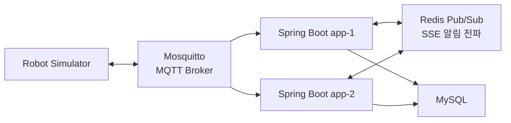
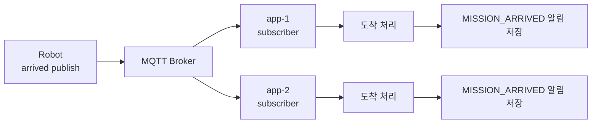
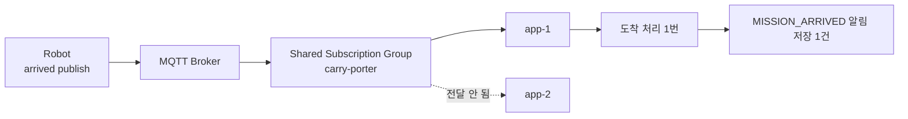

# MQTT 메시지가 멀티 인스턴스에서 두 번 처리된 이유

## 문제를 만난 배경

Spring Boot 인스턴스를 `app-1`, `app-2` 두 대로 실행한 뒤, 로봇이 발행한 MQTT 메시지가 서버에서 어떻게 처리되는지 확인하고 있었습니다.

구조는 다음과 같았습니다.



기대했던 흐름은 단순했습니다.

```text
로봇 arrived 메시지 1건 수신
-> 미션 도착 처리 1번
-> MISSION_ARRIVED 알림 저장 1건
-> SSE 알림 전송 1번
```

하지만 실제 멀티 인스턴스 환경에서는 로봇이 보낸 `arrived` 메시지가 `app-1`, `app-2`에서 각각 처리되면서 알림이 두 번 생성되는 문제가 발생했습니다.

---

## 증상

먼저 미션 생성 요청은 `app-2`에서 정상 처리됐습니다.

```text
carry-porter-app-2 | MissionService : mission 생성 요청: userId = 1
carry-porter-app-2 | MissionService : mission 생성 완료: userId = 1, missionId = 1
```

이후 로봇이 `arrived` 메시지를 발행했습니다.

문제는 `app-1`, `app-2`가 같은 `arrived` 메시지를 각각 수신했다는 점입니다.

```text
carry-porter-app-2 | RobotMqttInboundFlowConfig   : MQTT inbound message 수신: topic = v1/robots/AA:BB:CC:DD:EE:01/event/arrived, payload = {"missionId":1,"userId":1}
carry-porter-app-2 | RobotArrivedServiceActivator : RobotArrivedMessageReceivedEvent 발행
carry-porter-app-2 | MissionService               : MissionArrivedEvent 발행 완료
carry-porter-app-2 | NotificationService          : 알림 저장 완료: notificationId = 3, eventType = MISSION_ARRIVED

carry-porter-app-1 | RobotMqttInboundFlowConfig   : MQTT inbound message 수신: topic = v1/robots/AA:BB:CC:DD:EE:01/event/arrived, payload = {"missionId":1,"userId":1}
carry-porter-app-1 | RobotArrivedServiceActivator : RobotArrivedMessageReceivedEvent 발행
carry-porter-app-1 | MissionService               : MissionArrivedEvent 발행 완료
carry-porter-app-1 | NotificationService          : 알림 저장 완료: notificationId = 4, eventType = MISSION_ARRIVED
```

결과적으로 로봇은 `arrived` 메시지를 한 번 보냈지만, 서버에서는 각 인스턴스가 한 번씩 처리해서 `MISSION_ARRIVED` 알림이 2건 생성됐습니다.

```text
carry-porter-app-1 | NotificationService : SSE 알림 전송: notificationId = 3, eventType = MISSION_ARRIVED
carry-porter-app-1 | NotificationService : SSE 알림 전송: notificationId = 4, eventType = MISSION_ARRIVED
```

로그 기준으로 중복 처리는 MQTT inbound 단계에서 이미 시작되고 있었습니다.

즉 해결 지점은 알림 전파 계층이 아니라 MQTT 구독 구조였습니다.

---

## 원인 분석: 같은 topic을 구독한 app-1, app-2가 각각 메시지를 받았다

기존에는 두 Spring Boot 인스턴스가 같은 topic을 각각 일반 구독하고 있었습니다.

```text
v1/robots/+/event/#
```

MQTT broker 입장에서 `app-1`, `app-2`는 서로 다른 client입니다.  
따라서 같은 topic을 구독한 client가 여러 개 있으면, broker는 메시지를 각 client에게 모두 전달합니다.



즉 로봇이 `arrived` 메시지를 한 번 발행했지만, Spring Boot 인스턴스가 두 대였기 때문에 서버 입장에서는 각 인스턴스가 한 번씩, 총 두 번 처리한 것입니다.

---

## 해결 1: MQTT Shared Subscription 적용

멀티 인스턴스 환경에서 같은 MQTT 메시지를 하나의 인스턴스만 처리하도록 `shared subscription`을 적용했습니다.

기존 topic은 다음과 같았습니다.

```text
v1/robots/+/event/#
```

변경 후 topic은 다음과 같습니다.

```text
$share/carry-porter/v1/robots/+/event/#
```

`$share/{group}/{topicFilter}` 형식을 사용하면 같은 group에 속한 subscriber 중 하나만 메시지를 받습니다.



Docker Compose에서는 `$`가 환경 변수 치환 문자로 해석되기 때문에 `$$share`로 escaping했습니다.

```yaml
MQTT_INBOUND_TOPIC: ${MQTT_INBOUND_TOPIC:-$$share/carry-porter/v1/robots/+/event/#}
```

Spring application 설정에서는 다음 topic을 사용합니다.

```yaml
carry-porter:
  mqtt:
    inbound:
      topic: ${MQTT_INBOUND_TOPIC:$share/carry-porter/v1/robots/+/event/#}
```

이 변경으로 하나의 MQTT 메시지를 여러 Spring Boot 인스턴스가 동시에 처리하는 문제를 줄일 수 있었습니다.

---

## 해결 2: robot_event_id 기반 멱등성 처리

Shared Subscription은 “하나의 broker publish가 여러 인스턴스에 전달되는 문제”를 해결합니다.

하지만 이것만으로 모든 중복 상황이 사라지는 것은 아닙니다.

예를 들어 다음 상황에서는 같은 로봇 이벤트가 다시 들어올 수 있습니다.

```text
QoS 1 메시지 재전송
로봇 클라이언트 재연결
로봇 클라이언트 버그
네트워크 불안정으로 인한 재발행
```

따라서 로봇이 보내는 payload에 `robot_event_id`를 포함시키고, 서버는 이 값을 멱등성 키로 사용하도록 했습니다.

```text
{"robot_event_id":"5e5c66e7-88c2-4c44-8b9c-9e3c9848b0ff","missionId":1,"userId":1}
```

처리된 로봇 이벤트는 `processed_robot_events` 테이블에 저장합니다.

```java
@Entity
@Getter
@Table(name = "processed_robot_events")
@NoArgsConstructor(access = AccessLevel.PROTECTED)
public class ProcessedRobotEvent extends BaseEntity {

    @Id
    @GeneratedValue(strategy = GenerationType.IDENTITY)
    @Column(name = "processed_robot_event_id")
    private Long id;

    @Column(name = "robot_event_id", nullable = false, unique = true, length = 100)
    private String robotEventId;

    @Column(nullable = false, length = 50)
    private String robotMacAddress;
}
```

여기서 중요한 부분은 `robot_event_id`에 `unique = true`를 둔 것입니다.

이 제약 덕분에 같은 `robot_event_id`가 DB에 두 번 저장될 수 없습니다.

---

## 해결 3: Inbound Filter에서 1차 중복 차단

MQTT 메시지는 transformer를 거친 뒤 router로 가기 전에 dedup filter를 통과합니다.

```java
@Filter(inputChannel = "robotEventDedupFilterChannel", outputChannel = "robotEventRouterChannel")
public boolean robotEventDedupFilter(RobotInboundMessage inboundMessage) {
    boolean duplicated = robotEventDedupService.isDuplicatedRobotEvent(
            inboundMessage.payload().robotEventId(),
            inboundMessage.macAddress()
    );

    if (duplicated) {
        log.info("robot 이벤트 처리를 건너뜁니다: robotEventId = {}, eventName = {}, robotMacAddress = {}",
                inboundMessage.payload().robotEventId(), inboundMessage.eventName(), inboundMessage.macAddress());
    }

    return !duplicated;
}
```

이 filter는 이미 처리된 `robot_event_id`인지 확인합니다.

```java
public boolean isDuplicatedRobotEvent(String robotEventId, String robotMacAddress) {
    if (!StringUtils.hasText(robotEventId)) {
        log.warn("robotEventId 가 없어 robot 이벤트 처리를 차단합니다: robotMacAddress = {}", robotMacAddress);
        return true;
    }

    boolean duplicated = processedRobotEventRepository.existsByRobotEventId(robotEventId);

    if (duplicated) {
        log.info("이미 처리된 robot 이벤트입니다: robotEventId = {}, robotMacAddress = {}",
                robotEventId, robotMacAddress);
    }

    return duplicated;
}
```

따라서 이미 처리된 이벤트라면 service 계층까지 가지 않고 inbound pipeline에서 바로 차단됩니다.

---

## 해결 4: Unique 예외를 도메인 예외로 변환

filter는 1차 방어입니다.

하지만 `existsByRobotEventId()`는 조회 기반이기 때문에, 이론적으로는 다음과 같은 race window가 남아 있습니다.

```text
app-1: existsByRobotEventId("abc") -> false
app-2: existsByRobotEventId("abc") -> false

app-1: insert robot_event_id = "abc" 성공
app-2: insert robot_event_id = "abc" 시도
app-2: unique 제약 위반
```

Shared Subscription을 적용했기 때문에 이 상황이 발생할 가능성은 낮습니다.  
하지만 QoS 1 재전송이나 로봇 재발행까지 고려하면, 같은 `robot_event_id`가 다시 들어올 가능성은 남아 있습니다.

따라서 DB unique 제약 위반을 장애가 아니라 “이미 처리된 로봇 이벤트”라는 도메인 의미로 변환했습니다.

```java
@Transactional
public void markProcessedRobotEvent(String robotEventId, String robotMacAddress) {
    if (!StringUtils.hasText(robotEventId)) {
        throw new IllegalArgumentException("robotEventId 는 비어 있을 수 없습니다.");
    }

    try {
        processedRobotEventRepository.saveAndFlush(
                ProcessedRobotEvent.create(robotEventId, robotMacAddress)
        );
    } catch (DataIntegrityViolationException exception) {
        log.info("이미 처리된 robot 이벤트 저장 요청입니다: robotEventId = {}, robotMacAddress = {}",
                robotEventId, robotMacAddress);
        throw new RobotException(RobotErrorCode.DUPLICATE_ROBOT_EVENT);
    }

    log.info("robot 이벤트 처리 완료 저장: robotEventId = {}, robotMacAddress = {}",
            robotEventId, robotMacAddress);
}
```

`RobotErrorCode`에는 중복 로봇 이벤트 전용 코드를 추가했습니다.

```java
DUPLICATE_ROBOT_EVENT(HttpStatus.CONFLICT, "ROBOT_409", "이미 처리된 로봇 이벤트입니다.");
```

---

## 해결 5: Listener에서 중복 이벤트만 흡수

중복 이벤트 예외는 listener에서 로그만 남기고 종료하도록 했습니다.

로봇 메시지 기반 이벤트는 크게 두 listener에서 처리됩니다.

```text
RobotConnectionEventListener
-> connected
-> disconnected

MissionStatusEventListener
-> arrived
-> returned
-> emergency
```

예를 들어 미션 상태 변경 listener는 다음처럼 중복 이벤트만 흡수합니다.

```java
@Async("eventTaskExecutor")
@EventListener
public void handleRobotArrivedMessageReceivedEvent(RobotArrivedMessageReceivedEvent event) {
    log.info("RobotArrivedMessageReceivedEvent 수신: missionId = {}, robotEventId = {}, robotMacAddress = {}, userId = {}",
            event.missionId(), event.robotEventId(), event.robotMacAddress(), event.userId());

    try {
        missionService.arrive(event.missionId(), event.robotEventId(), event.robotMacAddress(), event.userId());
    } catch (RobotException exception) {
        handleDuplicateRobotEvent(exception, event.robotEventId(), event.robotMacAddress());
    }
}

private void handleDuplicateRobotEvent(RobotException exception, String robotEventId, String robotMacAddress) {
    if (exception.getErrorCode() != RobotErrorCode.DUPLICATE_ROBOT_EVENT) {
        throw exception;
    }

    log.info("이미 처리된 robot 이벤트이므로 mission 상태 처리를 건너뜁니다: robotEventId = {}, robotMacAddress = {}",
            robotEventId, robotMacAddress);
}
```

중요한 점은 모든 `RobotException`을 먹지 않는다는 점입니다.

```text
DUPLICATE_ROBOT_EVENT
-> 이미 처리된 이벤트이므로 로그만 남기고 종료

그 외 RobotException
-> 실제 장애일 수 있으므로 다시 throw
```

이렇게 해야 중복 이벤트만 정상 흐름으로 흡수하고, 실제 장애는 숨기지 않을 수 있습니다.

---

## 처리 완료 기록은 언제 저장하는가

처리 완료 기록은 실제 도메인 상태 변경과 같은 트랜잭션 안에서 저장합니다.

예를 들어 도착 처리는 다음 흐름입니다.

```java
@Transactional
public void arrive(Long missionId, String robotEventId, String robotMacAddress, Long userId) {
    Mission mission = missionRepository.findById(missionId)
            .orElseThrow(() -> new MissionException(MissionErrorCode.MISSION_NOT_FOUND));

    validateArrivalTarget(mission, robotMacAddress, userId);
    validateArrivalStatus(mission);

    mission.arrive();
    robotEventDedupService.markProcessedRobotEvent(robotEventId, robotMacAddress);

    eventPublisher.publishEvent(new MissionArrivedEvent(
            missionId,
            robotMacAddress,
            userId
    ));
}
```

이 구조에서는 `mission.arrive()`와 `processed_robot_events` 저장이 같은 transaction 안에서 처리됩니다.

따라서 도착 처리 중 예외가 발생하면 처리 완료 기록도 함께 rollback됩니다.  
반대로 도메인 처리가 성공해야만 해당 `robot_event_id`가 처리 완료로 남습니다.

---

## 결과

수정 후에는 로봇 이벤트가 중복으로 들어오더라도 서버 상태가 중복 변경되지 않습니다.

정상 흐름에서는 각 이벤트가 한 번씩 처리됩니다.

```text
id:1
event:ROBOT_ASSIGNED
data:{"eventType":"ROBOT_ASSIGNED","missionId":1,"userId":1,"message":"로봇 배정이 완료되었습니다.","failureCode":null}

id:2
event:MISSION_STARTED
data:{"eventType":"MISSION_STARTED","missionId":1,"userId":1,"message":"로봇이 출발했습니다.","failureCode":null}

id:3
event:MISSION_ARRIVED
data:{"eventType":"MISSION_ARRIVED","missionId":1,"userId":1,"message":"로봇이 목적지에 도착했습니다.","failureCode":null}
```

그리고 같은 `robot_event_id`가 다시 들어오면 다음처럼 처리됩니다.

```text
이미 처리된 robot 이벤트입니다
또는
이미 처리된 robot 이벤트이므로 mission 상태 처리를 건너뜁니다
```

즉, 중복 메시지는 장애로 전파되지 않고 이미 처리된 이벤트로 흡수됩니다.

---

## 정리

최종적으로 적용한 해결책은 다음과 같습니다.

| 문제 | 해결 |
|---|---|
| 여러 Spring Boot 인스턴스가 같은 MQTT 메시지를 모두 수신 | MQTT Shared Subscription 적용 |
| 로봇이 같은 이벤트를 다시 전송할 수 있음 | `robot_event_id`를 멱등성 키로 사용 |
| 이미 처리된 이벤트가 service까지 들어올 수 있음 | inbound filter에서 1차 차단 |
| 거의 동시에 같은 이벤트가 저장될 수 있음 | DB unique 제약으로 최종 방어 |
| unique 제약 위반이 장애처럼 보임 | `DUPLICATE_ROBOT_EVENT` 도메인 예외로 변환 후 listener에서 흡수 |

---

## 배운 점

멀티 인스턴스 환경에서 MQTT를 사용할 때는 각 Spring Boot 인스턴스가 broker 입장에서 독립적인 subscriber라는 점을 고려해야 합니다.

단일 인스턴스에서는 문제가 없던 일반 topic 구독 방식도, 인스턴스가 두 대 이상이 되면 같은 메시지를 각 인스턴스가 모두 받을 수 있습니다. 따라서 “하나의 메시지를 하나의 서버 인스턴스만 처리해야 하는가”를 먼저 판단하고, 그런 요구가 있다면 shared subscription을 고려해야 합니다.

또한 중복 메시지 처리는 단순히 “중복이면 무시한다”로 끝나지 않았습니다.  
QoS 1, 로봇 재연결, 로봇 클라이언트 재전송까지 고려하면 서버는 같은 이벤트가 다시 들어와도 결과가 같도록 멱등하게 설계되어야 했습니다.

이번 작업을 통해 정리한 기준은 다음과 같습니다.

```text
MQTT Shared Subscription
-> 멀티 인스턴스 간 동일 메시지 중복 소비 방지

robot_event_id
-> 로봇 이벤트의 멱등성 키

processed_robot_events
-> 처리 완료 여부 저장소

DB unique 제약
-> 최종 중복 저장 방어

DUPLICATE_ROBOT_EVENT
-> 중복 이벤트를 정상적인 무시 흐름으로 변환
```

결국 이 문제는 “메시지가 두 번 왔을 때 어떻게 막을 것인가”보다, “같은 의미의 이벤트가 여러 번 들어와도 서버 상태가 한 번 처리한 것과 같게 유지되는가”의 문제였습니다.
