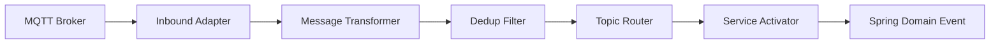
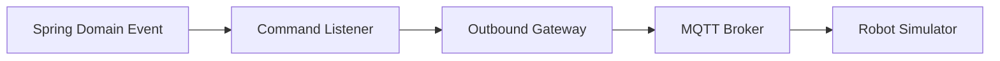
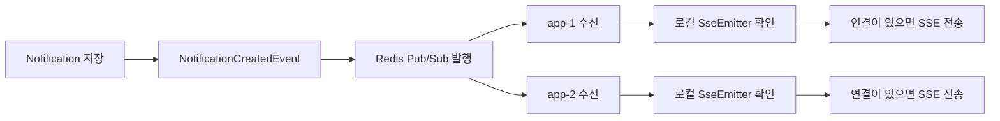

<a href="{{ '/projects' | relative_url }}">Projects</a>

<section class="project-hero">
  
  

    
2026.06 · Backend Refactoring

    
로봇 호출 서비스의 미션 상태 흐름, MQTT 메시지 파이프라인, SSE 실시간 알림 구조를 다시 설계하고 구현한 리팩토링 프로젝트입니다.

    

      Spring Boot
      Spring Integration
      MQTT
      SSE
      Redis Pub/Sub
      Testcontainers
    

  

</section>

## Overview

Carry Porter는 SSAFY에서 진행한 로봇 호출 서비스 팀 프로젝트입니다. 이 리팩토링에서는 기존 프로젝트를 기반으로 사용자의 로봇 호출 요청부터 배정, 출발, 도착, 복귀, 종료까지 이어지는 백엔드 흐름을 다시 설계했습니다.

주요 초점은 단순 기능 추가가 아니라, **이벤트 기반 흐름을 명확히 나누고**, **MQTT와 SSE 통신 경계를 정리하며**, **멀티 인스턴스 환경에서 발생하는 실시간 메시지 문제를 해결하는 것**이었습니다.

## Links

| Type | Link |
| --- | --- |
| Refactoring Repository | [carry-porter-be-refactoring](https://github.com/joonwan/carry-porter-be-refactoring) |
| Original Project | [joonwan/carryporter](https://github.com/joonwan/carryporter) |

## Refactoring Summary

| Area | Before | After |
| --- | --- | --- |
| MQTT Pipeline | callback 내부에서 topic 파싱, payload 변환, 메시지 분기 처리 | Spring Integration 기반 Adapter, Transformer, Filter, Router, Service Activator로 책임 분리 |
| SSE Notification | 메모리의 `SseEmitter`를 조회해 즉시 알림 전송 | 알림을 DB에 먼저 저장하고 SSE는 실시간 전달 수단으로 사용 |
| Multi Instance | SSE 연결이 각 인스턴스 메모리에만 존재 | Redis Pub/Sub으로 알림 생성 사실을 모든 인스턴스에 전파 |
| MQTT Deduplication | 동일 로봇 이벤트가 여러 인스턴스에서 중복 처리 가능 | MQTT Shared Subscription과 `robot_event_id` 기반 dedup 적용 |
| Concurrency Test | 테스트 트랜잭션과 서비스 트랜잭션 경계 혼재 | 일반 통합 테스트와 동시성 테스트 support class 분리 |

## Core Architecture

### MQTT Pipeline

MQTT 처리는 callback 중심 구조에서 pipeline 중심 구조로 바꿨습니다. 로봇이 보내는 메시지는 inbound pipeline을 거쳐 도메인 이벤트로 변환되고, 서버가 로봇에게 보내는 명령은 outbound pipeline을 통해 MQTT Broker로 발행됩니다.

#### Inbound Pipeline

#### Outbound Pipeline

### SSE Notification

SSE는 알림의 원본 저장소가 아니라 실시간 전달 수단으로만 사용했습니다. 알림 데이터는 DB에 먼저 저장하고, Redis Pub/Sub은 “알림이 생성되었다”는 사실을 여러 Spring Boot 인스턴스에 전파하는 역할만 담당합니다.

## Troubleshooting Highlights

### SSE 멀티 인스턴스 알림 전파

- 문제: 알림 생성 인스턴스와 SSE 연결 인스턴스가 달라 실시간 알림이 누락됨
- 해결: Redis Pub/Sub으로 알림 생성 사실을 모든 인스턴스에 전파
- 결과: 실제 `SseEmitter`를 가진 인스턴스가 SSE 전송 수행

[자세히 보기](/sse-multi-instance-redis-pubsub)

### MQTT 멀티 인스턴스 중복 메시지 처리

- 문제: 여러 Spring Boot 인스턴스가 동일 MQTT 메시지를 동시에 수신함
- 해결: MQTT Shared Subscription 적용 후 `robot_event_id`와 `processed_robot_events` 테이블로 중복 방어
- 결과: 같은 로봇 이벤트가 다시 들어와도 서버 상태가 멱등하게 유지됨

[자세히 보기](/mqtt-shared-subscription-dedup)

### Testcontainers 기반 동시성 테스트

- 문제: 비관적 락 기반 로봇 배정 동시성 테스트에서 모든 요청이 실패함
- 해결: 동시성 테스트에서는 setup 데이터가 실제 commit되도록 테스트 support class 분리
- 결과: 로봇 5대 기준 성공 5건, 실패 5건의 기대 결과 검증

[자세히 보기](/pessimistic-lock-concurrency-test)

## Retrospective

이번 리팩토링에서 가장 중요하게 본 것은 문제의 위치를 정확히 나누는 것이었습니다. SSE 문제는 알림 저장 문제가 아니라 연결 위치 문제였고, MQTT 중복 문제는 알림 계층이 아니라 broker 구독 구조의 문제였으며, 동시성 테스트 문제는 비관적 락 자체가 아니라 테스트 트랜잭션 경계 문제였습니다.

향후에는 MQTT command 발행 구간에 Outbox Pattern을 적용하고, `mission_status` 기반 Recovery Scheduler를 추가해 서버 장애로 인해 프로세스가 중간 상태에서 멈추는 문제를 보완할 계획입니다.
